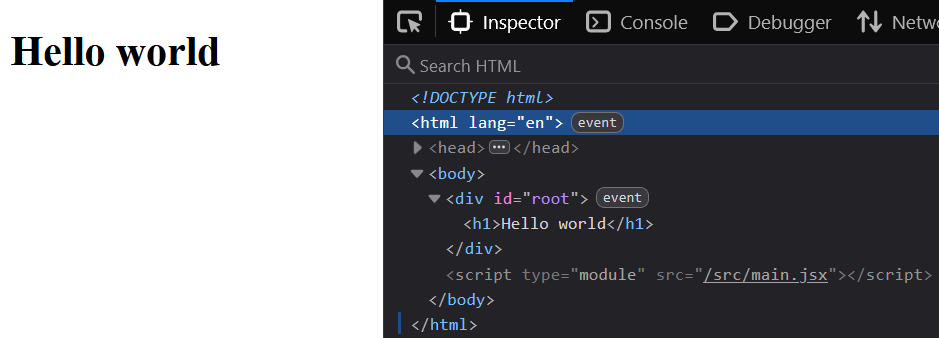

# React project aanmaken

Het aanmaken van een React project gebeurt kan op verschillende manieren.

|Vite|Handmatig|
|-----|--------|
`npm create vite@latest`<br>`npm install`| - Projectmap aanmaken. <br>- NPM initialiseren.<br>- React en ReactDOM installeren. <br>- Webpack en Babel installeren.<br>- Project structuur aanmaken.<br>- Babel configureren.<br>- Webpack configureren.<br>- index.html aanmaken.<br>- React code schrijven om framework op te starten. 

1. npm create vite@latest
De Node Package Manager maakt 
2. npm install
Met npm installeren we alle nodige node packages. Welke node packages dat zijn staat beschreven in `package.json`. 
3. npm run dev
Met dit commando activeren we het `dev` script. Wat dat script doet staat ook beschreven in `package.json`. 

## React project draaien
Met het commando `npm run dev` gaan we het project uitvoeren. Vite gaat de develop tools opstarten en het project draaien. Onder developtools vallen:
* Development server. HTML, css en javascript worden gedraaid.
* Hot reloading. Elke keer er wijzigingen zijn wordt dit automatisch verwerkt in de website.
* es-build. Dit compiled de meest nieuwe versie van Javascript/Typescript naar wat de browser kan gebruiken.

Dit (en meer!) gebeurt allemaal met alleen de commando *'npm run dev'*.


## React project maken
Maak de CSS bestanden leeg. We gaan onze eigen CSS schrijven.
Open `App.jsx`, en haal het meeste weg. Alleen het volgende moet overblijven. 

app.js  
{: .code-label }

```jsx
import './App.css'

function App() {
  return (
    <h1>Hello world</h1>
  )
}

export default App
```

## Open de applicatie in de browser
Wanneer je `npm run dev` hebt uitgevoerd in de terminal, wordt er niet alleen een development server aangezet, ook wordt jouw hele project gebundelt. Iedere keer als je iets wijzigt aan jouw project wordt dit automatisch verwerkt. Open jouw website. Als het goed is zie je het volgende:



Het volgende hoofdstuk gaan we aan de slag met JSX, en beginnen met het bouwen van een website. 
[Volgend hoofdstuk: JSX](3jsx)