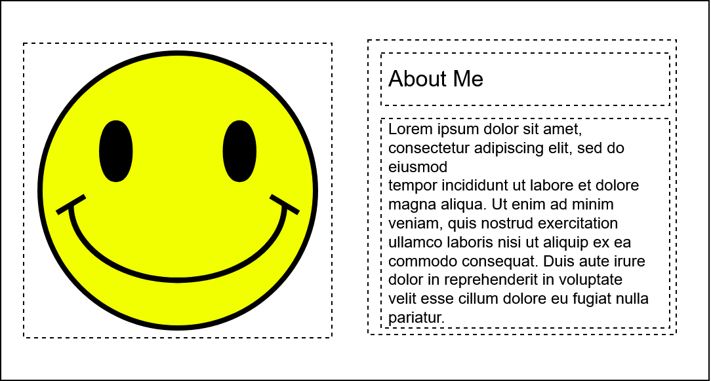

## Eerste component

Om een component te maken, maak een nieuw bestand aan met de naam van jouw component. Denk hier bij goed aan de hoofdletters. Ons component gaat heten *AboutMe*. Dus maak een bestand aan genaamd `AboutMe.jsx`. 

Van origine werd er bij React gebruik gemaakt van *'class components'*, waarbij ieder component een eigen class was. 
```jsx
class Car extends React.Component {
  render() {
    return <h2>Hi, I am a Car!</h2>;
  }
}
```

Sinds 2021, in modern React wordt gebruik gemaakt van *'functional components'*, wat betekent dat een component bestaat uit een functie. Dit gaan wij ook gebruiken. 

AboutMe.jsx  
{: .code-label }
```jsx
function AboutMe(){
    return (
        <h1>About Me</h1>
    )
}
```

## Component Exporteren
Als we dit component in een ander bestand willen gebruiken, moeten we het component exporteren. Dat doen we met *export*. Zet voor `AboutMe` component het keyword `export`.
```jsx
export function AboutMe(){
...
```

## Component Importeren
Het component wordt nu ge-exporteert. Dan kunnen we deze importeren. We willen ons **AboutMe** component gebruiken in de **App** component. Open *App.jsx*. Zet boven in `import { AboutMe } from './AboutMe';`. Deze regel haalt het *AboutMe component* uit het AboutMe.jsx bestand.

## Component Toevoegen
Een react component, de JSX daarvan, heeft een root component nodig. Je kan niet meerdere losse components er in zetten, dat geeft een error. Omdat ons project straks gaat bestaan uit meerdere componenten, niet alleen *AboutMe*, moet de App component ook een **root** element hebben. Het root element kan bijvoorbeeld een `main` element zijn.

App.jsx
{: .code-label }
```jsx
function App() {
  return (
    <main>
      <AboutMe/>
    </main>
  )
}
```

Als het goed is, zie je nu het **AboutMe** component. Omdat er nog geen CSS of andere HTML code is, is alleen het AboutMe component zichtbaar, met alleen de tekst 'about me'.

## De 'HTML' code.
Ga nu de rest van de HTML code schrijven om het volgende wireframe te maken.


* Het root element is een article element, of een section element. Geef deze de className `AboutMe`.
* De afbeelding is een img element.
* De tekst komt naast de afbeelding, en de h2 boven de text. Dus een `div` element als container. In de div:
  * `h2` voor de titel. Geef deze de className *aboutMe__title*.
  * `p` voor de uitleg. Geef deze de className *aboutMe__paragraph*
* Stylen doen we in het volgende hoofdstuk.

[Volgende hoofdstuk: Component stylen](3componentstylen)